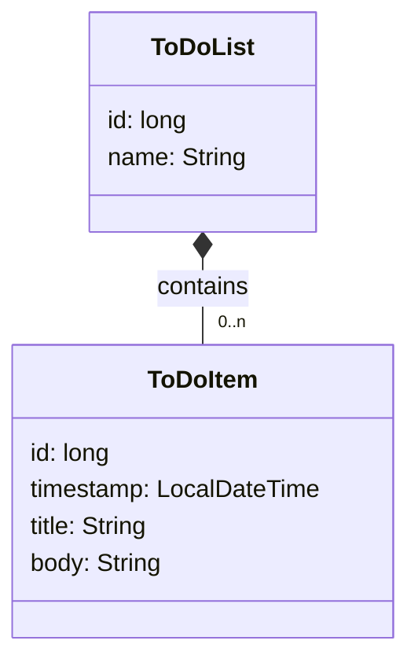

# Example Micronaut microservice + client

This project contains an example of a small microservice developed with [Micronaut](https://micronaut.io/).

## Bounded context: to-do lists

The microservice can keep track of one or more to-do lists with their own names.
Each list has zero or more items, with titles, bodies, and timestamps.



## Endpoints

The microservice has RESTful endpoints for both lists and items.
For a list of the endpoints, consult the [`ToDoListClient`](todo-cli/src/main/java/todo/cli/ToDoListClient.java) declarative HTTP client.

## Development with Eclipse

To work on this project from Eclipse 4.9 and onwards, make sure you have [Eclipse Buildship](https://www.vogella.com/tutorials/EclipseGradle/article.html) installed, and that you are using [Java 11](https://adoptium.net/) or later.

Clone the project, and run this command to generate the relevant Eclipse-specific projects:

```sh
./eclipse.sh
```

Use Eclipse to import the projects, selecting `File - Import... - Gradle - Existing Gradle Project`.
Import `todo-cli` and `todo-microservice` separately: the order does not matter.

To run the microservice, use the `Gradle Tasks` view to start the `run` task of the `todo-microservice` project.

To run the CLI tool, the most convenient option for development is to use the `run` task as well, but from a console:

```sh
cd todo-cli
./gradlew run --args='--help'
```

## Integration testing with Docker Compose

To try out the microservice running on its own Docker image, run these commands from this folder:

```sh
cd todo-microservices
./gradlew dockerBuild
cd ..
./compose-it.sh up -d
```

This will build the Docker image of the microservice, and then start it together with its dependencies and some web-based UIs to help debugging.

Alternatively, you can use  `./gradlew dockerBuildative` to make Micronaut use GraalVM to produce Docker images based on binary executables, which should boot significantly faster.
This will take a long time to compile, and will require a reasonably strong machine.

## Distributing the CLI client

### ZIP distribution (requires Java)

To create a Java-based distribution of the CLI tool, run these commands from this folder:

```sh
cd todo-cli
./gradlew distZip
```

This will produce a `.zip` in `build/distributions` that other users can run, providing they have Java installed.

### Docker image (Java-based or native)

You can also use `dockerBuild` and `dockerBuildNative` for `todo-cli`, similarly to `todo-microservice`:

```sh
cd todo-cli
./gradlew dockerBuild       # for Java-based image
./gradlew dockerBuildNative # for native image
```

### Local native executable

Instead of a Java program, you can produce a native image, which should boot significantly faster, and does not require having Java installed.

You will need to have a GraalVM JDK installed: it is recommended to use [SDKMAN](https://sdkman.io/) to set it up.
Once you have SDKMAN installed, you can run:

```sh
sdk install java 17.0.8-graalce
sdk use java 17.0.8-graalce
cd todo-cli
./gradlew nativeCompile
```

This will produce an executable in `build/native/nativeCompile` that you can redistribute.

## Micronaut 3.x version of the microservice

The [`todo-microservice-v3`](./todo-microservice-v3) directory has a version of the same microservice, based on Micronaut 3.x and Java 11.

It is functionally equivalent to the Micronaut 4.x version.
It includes a [backport](https://github.com/micronaut-projects/micronaut-data/commit/1190f94e0286f773d21e805531f61cb23a7e18fa) of a known issue with JSON serialisation of `Page` objects, which has been fixed in Micronaut 4.x.

Note that Micronaut 3.x uses Hibernate 5, whereas Micronaut 4.x uses Hibernate 6.
This means that Micronaut 3.x uses a slightly different database structure: `hibernate_sequence` is a regular table with Micronaut 3.x, and an actual [sequence](https://mariadb.com/kb/en/sequences/) with Micronaut 4.x.

If you want to try out the demo microservice in a different Micronaut version from Docker Compose, make sure to drop all volumes first, with:

```shell
./compose-it.sh down -v
```
