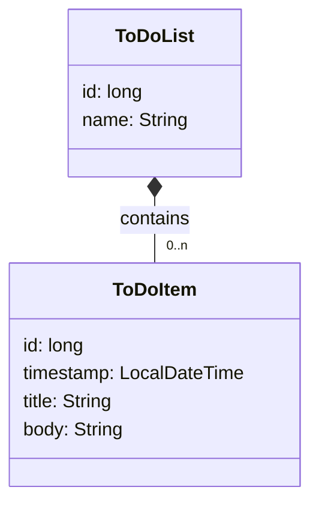
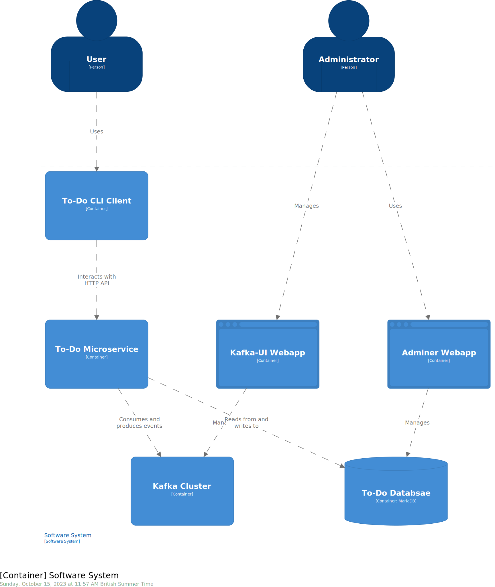

# Example Micronaut microservice + client

This project contains an example of a small microservice developed with [Micronaut](https://micronaut.io/).

## Bounded context: to-do lists

The microservice can keep track of one or more to-do lists with their own names.
Each list has zero or more items, with titles, bodies, and timestamps.



## C4 container model

The system can be described through the following [C4 container model](https://c4model.com/):



## Endpoints

The microservice has RESTful endpoints for both lists and items.
For a list of the endpoints, consult the [`ToDoListClient`](todo-cli/src/main/java/todo/cli/ToDoListClient.java) declarative HTTP client.

## Development with Eclipse

To work on this project from Eclipse 4.9 and onwards, make sure you have [Eclipse Buildship](https://www.vogella.com/tutorials/EclipseGradle/article.html) installed, and that you are using [Java 11](https://adoptium.net/) or later.

Clone the project, and run this command to generate the relevant Eclipse-specific projects:

```sh
./eclipse.sh
```

Use Eclipse to import the projects, selecting `File - Import... - Gradle - Existing Gradle Project`.
Import `todo-cli` and `todo-microservice` separately: the order does not matter.

To run the microservice, use the `Gradle Tasks` view to start the `run` task of the `todo-microservice` project.

To run the CLI tool, the most convenient option for development is to use the `run` task as well, but from a console:

```sh
cd todo-cli
./gradlew run --args='--help'
```

## Integration testing with Docker Compose

To try out the microservice running on its own Docker image, run these commands from this folder:

```sh
cd todo-microservices
./gradlew dockerBuild
cd ..
./compose-it.sh up -d
```

This will build a Java-based Docker image of the microservice, and then start it together with its dependencies and some web-based UIs to help debugging.

### Native Docker images (advanced, optional)

Alternatively, you can use  `./gradlew dockerBuildNative` to make Micronaut use GraalVM to produce Docker images based on binary executables, which should have better performance and use less memory.
This will take a long time to compile, and will require a strong machine: the process can take 6GiB+ of RAM on its own.

*Note*: Kafka Streams (KStreams for now on) does not have official GraalVM native image support, so this example microservice needed a number of custom settings to support it.
See below:

* [`build.gradle`](./todo-microservice/build.gradle) adds several `native-image` build arguments in its `graalvmNative` block to include two additional resources in the native image (the RocksDB dynamic library and the Kafka Streams `.properties`), and provide a `jni-config.json` file that exposes some RocksDB classes from JNI. These are based on the [sample project by Pádraig de Buitléar](https://github.com/pdebuitlear/kstreams-demo/blob/main/src/main/java/com/example/demo/config/hints/KafkaStreamsHints.java), which used Spring Boot GraalVM instead.
* The main `Application` class includes a `@TypeHint` annotation which was iteratively refined to include the classes accessed via reflection by Kafka Streams for this particular example. It is likely that you may need to add more classes for a different example.

The above customisations were made to show that it is indeed possible to run KStreams in a native image, but they are likely to require changes with new KStreams releases.
You can ignore them if you are not building native images.

We recommend to avoid using native images if using KStreams, until they add official GraalVM native image support.
You should have no issues using plain Kafka consumers and producers in native images, however, as the Micronaut Kafka project does include the [necessary GraalVM configuration files](https://github.com/micronaut-projects/micronaut-kafka/tree/4.5.x/kafka/src/main/resources/META-INF/native-image/io.micronaut.kafka/micronaut-kafka) for it.

## Viewing and editing the C4 model

The above C4 model was created using the textual [Structurizr DSL](https://docs.structurizr.com/dsl/).

The Compose file includes a container that runs the [Structurizr Lite](https://structurizr.com/help/lite) Docker image, which will automatically visualise the contents of the [`structurizr/workspace.dsl`](structurizr/workspace.dsl) file.
After running `./compose-it.sh up -d`, Structurizr Lite is available from this URL:

http://localhost:8081/

To experiment with the Structurizr DSL, edit the `workspace.dsl` with your preferred text editor, and reload the page.

## Distributing the CLI client

### ZIP distribution (requires Java)

To create a Java-based distribution of the CLI tool, run these commands from this folder:

```sh
cd todo-cli
./gradlew distZip
```

This will produce a `.zip` in `build/distributions` that other users can run, providing they have Java installed.

### Docker image (Java-based or native)

You can also use `dockerBuild` and `dockerBuildNative` for `todo-cli`, similarly to `todo-microservice`:

```sh
cd todo-cli
./gradlew dockerBuild       # for Java-based image
./gradlew dockerBuildNative # for native image
```
